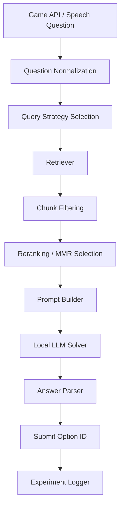
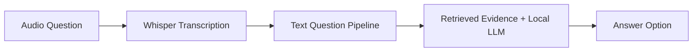

# Who Wants to Be a PoliMillionaire? — NLP Quiz Agent

This repository contains our Natural Language Processing group project for the **Who Wants to Be a PoliMillionaire?** online quiz assignment. The goal of the project is to build, evaluate, and improve an automatic chatbot capable of playing multiple-choice quiz competitions through the provided game API.

The project investigates several NLP approaches, including local language models, retrieval-augmented generation, query rewriting, retrieval benchmarking, reranking, and speech-based question answering.

---

## Project Overview

The game presents multiple-choice questions under a strict time limit. Our system connects to the game programmatically, retrieves or reasons over supporting evidence, selects one of the available answers, and logs the result for later evaluation.

The project was developed in three main stages:

1. **Exploratory retrieval and solver experimentation**  
   Implemented mainly in `PoliMillionaire_Web_Retrieval.ipynb`.

2. **Final modular competition pipeline**  
   Implemented in `Polymillionaire_Final.ipynb`, supporting both text and speech modes, experiment clustering, configuration comparison, and final competition execution.

3. **Math competition further investigation**  
   Implemented in `Math_Competition.ipynb`, focusing on reasoning-focused local models, timed thinking strategies, and calculator-assisted solving for math questions.

---

## Repository Structure

```text
.
├── PoliMillionaire_Web_Retrieval.ipynb   # Exploration notebook: API connection, retrieval benchmarking, LLM trials
├── Polymillionaire_Final.ipynb           # Final pipeline: text + speech modules, experiment configs, clusters, final runs
├── Math_Competition.ipynb                # Math-specific investigation with timed reasoning and calculator-tool ablations
├── README.md                             # Project documentation
└── millionaire_client/                   # Provided client package for interacting with the game API
```

> Note: The mathematics competition was treated separately because many math questions require calculation or symbolic reasoning rather than normal web retrieval.

---

## Assignment Context

The assignment asks groups to build a Python notebook, preferably in Google Colab, that develops and evaluates chatbot models for the online PoliMillionaire quiz. The evaluation considers leaderboard performance, the variety and quality of investigated models, architectures such as RAG and speech transcription, the level of evaluation, and the clarity of analysis.

A key constraint is that final language models should be open-weight/local models, while retrieval APIs are acceptable only when they return raw non-generated content rather than LLM-generated answers.

---

## System Architecture

The final system follows a retrieval-augmented multiple-choice answering pipeline.



For speech competitions, an additional transcription step is added before the same text pipeline:



---

## Notebook 1: `PoliMillionaire_Web_Retrieval.ipynb`

This notebook was used as the main research and experimentation notebook. It started from the provided API tutorial and gradually evolved into a full experimental environment.

### 1. Dynamic Game Connection

We first focused on moving from manual gameplay to automatic interaction with the game API. The notebook includes:

- authentication with the game server,
- listing available competitions,
- starting a game session,
- reading the current question and options,
- submitting answers automatically,
- tracking level, correctness, timing, and selected answer.

A random baseline solver was implemented first to verify that the automated game loop worked correctly before adding LLM-based reasoning.

### 2. Question Bank Construction

To avoid excessive live API calls during experimentation, we created a hardcoded question bank collected from several competitions. This allowed us to benchmark retrieval methods and prompts offline before consuming live game attempts.

The question bank included examples from:

- Ancient History and Politics,
- Entertainment,
- Science and Nature,
- Maths.

Each question was enriched with metadata such as question type, whether retrieval was needed, expected answer, keywords, and whether a tool such as a calculator would be more suitable.

### 3. Local LLM Baselines

We tested different LLM-based solvers, beginning with simple local models and then moving to stronger instruction-following models.

Tested or explored models included:

- `google/flan-t5-base`,
- `mistralai/Mistral-7B-Instruct-v0.2`,
- Qwen2.5 models in the final pipeline,
- Groq-hosted Llama models as an exploratory comparison.

The FLAN-T5 stage helped us build the basic answer-formatting and parsing logic. Mistral was then used for stronger retrieval-augmented answering and also as an LLM-based retrieval judge.

> Groq was used as an exploratory comparison and not as the main compliant local model pipeline.

### 4. Retrieval-Augmented Generation Experiments

We experimented with multiple retrieval sources:

| Retriever | Purpose |
|---|---|
| Wikipedia | Fast encyclopedic baseline for factual questions |
| DuckDuckGo | Broader web retrieval with better coverage |
| Tavily | Search API for semantically focused web results |
| SerpAPI | Google-based retrieval benchmark |

The retrievers were evaluated separately from the LLM before being integrated into a full RAG solver. This helped us understand whether failures came from retrieval, reasoning, answer parsing, or evaluation limitations.

### 5. Retrieval Benchmarking

The notebook benchmarked retrieval systems using the hardcoded question bank. Metrics included:

- whether the expected answer appeared in retrieved content,
- keyword coverage,
- top-result relevance,
- latency,
- per-competition retrieval behavior.

A key finding was that exact answer matching is too limited as a retrieval metric. Some retrieved documents were semantically useful even when they did not contain the exact expected answer string. Conversely, some irrelevant documents could accidentally contain the answer text.

### 6. Query Strategy Experiments

We tested multiple ways of converting a quiz question into a search query:

- `raw_question`,
- `question_plus_options`,
- `keyword_condensed`,
- `domain_prefixed`,
- `entity_focused`,
- `llm_rewrite`.

The experiments showed that retrieval quality depends strongly on query formulation, not only on the retrieval engine. Domain-aware and entity-focused queries were often more useful than simply sending the raw question.

### 7. LLM-Based Retrieval Judging

To move beyond lexical matching, we introduced an LLM judge. The judge evaluated whether retrieved evidence was actually useful for answering the question.

This helped separate three different failure types:

1. retrieval failure,
2. reasoning failure,
3. evaluation failure.

This was especially important for math and reasoning-heavy questions, where retrieval alone is often insufficient.

### 8. Live Competition RAG Evaluation

After offline retrieval testing, we integrated retrieval with the LLM solver and tested live game runs. The most important live RAG pipeline combined:

- DuckDuckGo retrieval,
- local Mistral-7B-Instruct,
- constrained multiple-choice prompting,
- strict option-number parsing.

This pipeline performed better on factual and knowledge-based competitions, especially entertainment, history, politics, biology, and general science questions. It was weaker on questions requiring calculation, multi-step reasoning, or noisy retrieval interpretation.

---

## Notebook 2: `Polymillionaire_Final.ipynb`

The final notebook consolidates the lessons from the exploratory notebook into a more modular and reusable pipeline.

### Main Features

- Supports both text and speech competitions.
- Uses Whisper transcription for the speech interface.
- Reuses the same text pipeline after transcription.
- Focuses retrieval mainly on Wikipedia, DuckDuckGo, and combined retrieval.
- Uses local Qwen2.5 models:
  - `Qwen2.5-1.5B`,
  - `Qwen2.5-3B`.
- Supports multiple query strategies.
- Adds filtering, ranking, dense retrieval, hybrid scoring, MMR, and cross-encoder reranking.
- Defines experiment configurations and groups them into clusters.
- Runs experiments by cluster, summarizes results, and selects the best configuration per competition.
- Includes a final game-running section that uses the selected best configuration for each competition.

---

## Notebook 3: `Math_Competition.ipynb`

The math competition was investigated in a separate notebook because normal retrieval-augmented answering is often not the best fit for math questions. Many questions require calculation, symbolic manipulation, or multi-step reasoning rather than finding a factual statement online.

### Main Features

- Tests reasoning-focused local models:
  - `deepseek-ai/DeepSeek-R1-Distill-Qwen-7B`,
  - `Qwen/Qwen2.5-7B-Instruct`.
- Uses timed thinking phases with soft and hard deadlines.
- Adds forced final-answer extraction so the solver returns a valid option before the game deadline.
- Compares DeepSeek timing strategies with and without soft-deadline wrap-up behavior.
- Compares Qwen with and without a calculator-style math tool.
- Uses a restricted Python/SymPy calculation namespace for tool-assisted math solving.
- Produces per-game and summary CSV outputs for comparison.

### Math Investigation Design

The notebook separates solver behavior into reusable components:

- question formatting,
- answer parsing and cleanup,
- model loading and timed generation,
- Qwen calculator-tool execution,
- DeepSeek tool-free reasoning,
- solver configuration,
- ablation execution,
- result summarization.

---

## Final Retrieval and Ranking Layer

The final pipeline includes several retrieval filtering and reranking strategies:

| Method | Description |
|---|---|
| BM25 | Sparse keyword-based ranking |
| Dense retrieval | Embedding-based semantic ranking |
| Hybrid ranking | Combines BM25 and dense scores |
| RRF | Reciprocal Rank Fusion over multiple rankings |
| MMR | Selects relevant but diverse chunks |
| Cross-encoder reranking | Reranks candidate chunks using a stronger relevance model |

Embedding models used or prepared:

- `BAAI/bge-small-en-v1.5`,
- `BAAI/bge-base-en-v1.5`,
- `intfloat/e5-base-v2`.

Reranker models used or prepared:

- `cross-encoder/ms-marco-MiniLM-L6-v2`,
- `BAAI/bge-reranker-base`.

---

## Query Strategies

The final pipeline supports the following query strategies:

```python
[
    "raw_question",
    "question_plus_options",
    "keyword_condensed",
    "domain_prefixed",
    "entity_focused",
    "llm_rewrite",
]
```

These strategies are used to test whether better search formulation improves retrieval quality and final answer accuracy.

---

## Experiment Design

Instead of testing one configuration manually, we defined structured experiment configurations. Each configuration can vary:

- retriever type,
- query strategy,
- model choice,
- number of retrieved documents,
- filtering method,
- reranking method,
- prompt template,
- speech/text mode,
- competition type.

Configurations were grouped into clusters so that related experiments could be run and compared systematically.

The final workflow is:

1. Select a cluster of configurations.
2. Run live or offline experiments.
3. Log question-level results.
4. Summarize results by run.
5. Summarize results by competition.
6. Select the best configuration for each competition.
7. Run the final game using the selected configuration.

---

## Speech Module

The speech module adds a Whisper transcription step before the normal text pipeline.

The flow is:

1. receive audio question,
2. transcribe using Whisper,
3. pass the transcribed question to the same retrieval and LLM pipeline,
4. return the selected answer option.

The speech module worked, but performance was limited by the quality of the audio input. When transcription errors occurred, the downstream retrieval and answering pipeline was affected. Therefore, speech performance was generally weaker than text-mode performance.

---

## Key Findings

### Retrieval Helps Factual Questions

RAG improved performance for questions based on factual knowledge, named entities, history, entertainment, and science facts.

### Search Engine Choice Matters

DuckDuckGo and SerpAPI generally provided broader coverage than Wikipedia-only retrieval. Wikipedia remained useful for direct encyclopedic questions but was weaker for broad or contextual questions.

### Query Formulation Matters

`domain_prefixed`, `entity_focused`, and `question_plus_options` often improved retrieval quality compared with raw questions.

### Exact-Match Evaluation Is Not Enough

Many retrieved documents were useful even when the exact answer string was not present. This motivated the use of LLM-based retrieval judging and more semantic evaluation.

### Math Requires a Different Pipeline

Math questions often require calculation or symbolic reasoning rather than web retrieval. For this reason, the math competition was separated into `Math_Competition.ipynb`, where DeepSeek and Qwen were tested with timed reasoning, wrap-up prompts, forced answer extraction, and Qwen calculator-tool ablations.

### Speech Adds Noise

The speech version uses the same core answering system, but Whisper transcription errors can reduce final accuracy when the audio quality is poor.

---

## Running the Project

### 1. Open in Google Colab

The notebooks were designed for Google Colab.

Recommended runtime:

- GPU runtime for local LLM inference,
- sufficient RAM for loading local models and embedding/reranking models.

### 2. Mount Google Drive

The notebooks expect the `millionaire_client` package to be available from Google Drive or the local notebook environment.

### 3. Configure Secrets

Some notebooks use Colab secrets for credentials and optional search APIs.

Example secret names used during development:

```text
poli-millionaire
Tavili-API-Key
SerpAPI
GROQ_API_KEY
hugging-face-token
```

Only the game credentials are required for live gameplay. Search API keys are only needed for the corresponding optional experiments.

### 4. Run the Notebook Sections

Recommended order:

1. Install dependencies.
2. Import and configure the game client.
3. Load model and retriever settings.
4. Run offline/smoke tests.
5. Run experiment clusters.
6. Review summaries.
7. Run the final selected competition pipeline.
8. For the math competition, run `Math_Competition.ipynb` separately and review its ablation summaries.

---

## Technologies Used

- Python
- Google Colab
- Hugging Face Transformers
- Sentence Transformers
- BM25
- Cross-encoder reranking
- Wikipedia retrieval
- DuckDuckGo retrieval
- Tavily search
- SerpAPI / Google Search benchmarking
- Whisper speech transcription
- Qwen2.5 local LLMs
- DeepSeek-R1-Distill-Qwen local reasoning model
- FLAN-T5 baseline
- Mistral-7B-Instruct experiments
- SymPy and SciPy for math-tool experiments
- Pandas for experiment logging and analysis

---

## Limitations

- Live game performance depends on API latency and the 30-second question limit.
- Retrieval can introduce noisy or misleading evidence.
- Smaller local models are faster but may reason less reliably.
- Larger local models are stronger but harder to run within Colab constraints.
- Keyword-based retrieval metrics can underestimate semantic usefulness.
- Speech-mode accuracy depends strongly on transcription quality.
- Math questions require tool-based reasoning rather than normal RAG.

---

## Academic Integrity Note

Coding assistants were used to support implementation, debugging, and documentation. The project design, experimentation, testing, and final decisions were conducted by the group.

---

## Contributors

Add group member names and emails here:

```text
- Youssef Abdalla — youssefmahmoud.abdalla@mail.polimi.it
- Sana Harighi — sana.harighi@mail.polimi.it
- Amirparsa Salmankhah — amirparsa.salmankhah@mail.polimi.it
```

---

## Presentation

The video link :

```text
Video link: <insert link>
```
